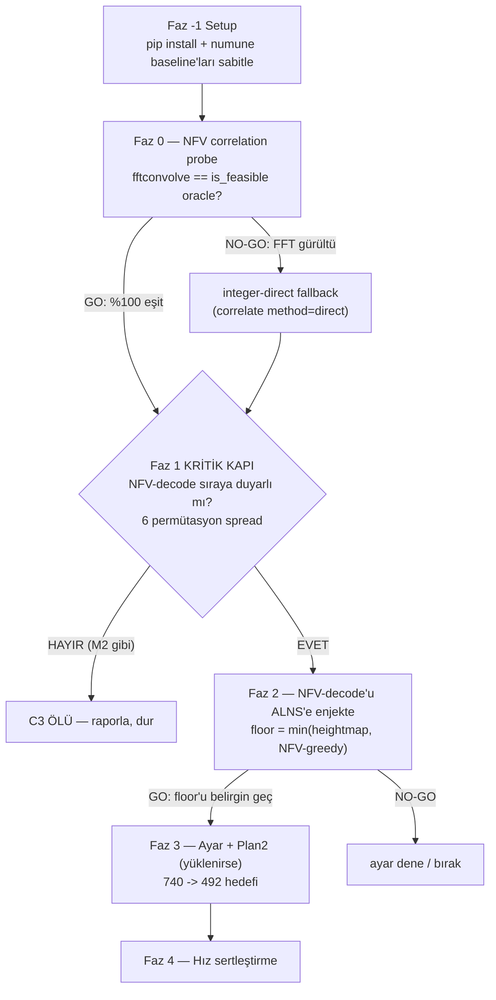

# C3 — Gerçek Geometrik NFV + ALNS ile Cavity Nesting

> **Bu dosya bir HANDOFF SPEC'tir.** Gerekli kodu başka bir Claude session'ı yazıp uygulayacak.
> O yüzden her faz; hangi dosya, ne değişiklik, hangi sırada, nasıl doğrulanır — uygulayıcının
> soru sormadan ilerleyebileceği netlikte yazıldı. Plan2 STL dosyaları kullanıcı tarafından bu
> container'a yüklenecek (aşağıda yol belirtildi).

## Context (neden bu iş)
Nesting motorumuzun tek kalan kalite açığı **cavity nesting** (parçaları birbirinin oyuğuna
geçirme). Bu açığı kapatmak için 5 bağımsız deney yapıldı (M1 greedy cavity, M2 order-SA,
M3 seçim kuralı, M4 beam, M6 hibrit) — hepsi NO-GO. Kanıtlanan kök neden: **miyopi** —
tek-geçiş/lokal-arama constructive cavity, bir parçayı boşluğa koyunca gelecekteki parçaların
o boşluğu kullanmasını engelliyor.

Geriye tek yol: **gerçek geometrik NFV (No-Fit-Voxel) + global metaheuristik (ALNS)**.
Bu büyük/belirsiz bir araştırma işi, o yüzden **kademeli ve GO/NO-GO kapılı** ilerlenecek: en
kritik bilinmez (**NFV-decode sıraya duyarlı mı?**) en ucuz şekilde, ALNS yazmadan **önce**
ölçülecek. Amaç: ya cavity'yi kanıtla kazandır, ya da en az çabayla "ölü" deyip kapat.

## ⚠️ Bu ortamla ilgili keşfedilen iki gerçek (taslaktan sapma)
Kod keşfi sırasında planı etkileyen iki somut durum bulundu:

1. **Python bağımlılıkları KURULU DEĞİL.** Bu remote container'da numpy/scipy/trimesh yok.
   `pip install -r requirements.txt` çalışıyor (ağ açık; dry-run `scipy-1.17.1` + `numpy-2.4.6`
   kuracağını doğruladı — taslaktaki scipy 1.17.1 varsayımı kurulumdan sonra doğru olur). numba
   yok (zaten istenmiyor). **Faz −1 (Setup) eklendi.**

2. **Plan2 STL'leri ARTIK YÜKLENDİ (tam set).** Orijinal scriptler (`m2_prototype.py:29`,
   `m6_plan2_hybrid.py`) STL'leri sabit Windows yolundan glob'lar — Linux'ta boş. Kullanıcı
   16 tipin tamamını container'a yükledi:
   **`/root/.claude/uploads/5d0ecbc4-a1e6-50d7-821c-42c9f5409fb8/*.stl`** —
   doğrulandı: **16/16 tip, 226/226 parça** (m6 QTY ile birebir; Magics 492.39 mm referansı).
   - **Ad-normalizasyonu ZORUNLU (kanıtlandı):** yüklenen dosya adlarında (a) başta 8-hex hash
     öneki (`9242f7a5-…`), (b) tireler soyulmuş (`POTR15498917667_P282410` ↔ QTY
     `PO-TR154989-17667_P282410`), (c) `PARCA_NYLON12…` ↔ `PARCA_NYLON-12…`. `build_instance_
     from_order` yalnız case-insensitive eşler, tire-insensitive DEĞİL. Eşleme reçetesi:
     `norm(s) = re.sub(r'[^a-z0-9]','', s.lower())`; her uploaded dosyanın `^[0-9a-f]{8}-`
     öneki soyulup stem normalize edilir, QTY anahtarının normalize hâliyle eşlenir. Bu reçete
     16/16'yı eşledi (1 dosya mükerrer yüklenmiş — normalize ad ile tekilleştirilir).
   - **İlk gate (Faz 0-1) yine `numune` üzerinde koşar** — en hızlı, bağımsız, in-repo
     (`model_set("numune")`, `models.py:163`; `Numuneler/1..8.stl`, 48 parça, plaka 335,
     pitch 2.0; konkav delikli plakalar n3/n6/n7/n8, `models.py:51`). Harness şablonu
     `scripts/m1_numune_gonogo.py`. Sebep: kapı kararı testbed-bağımsız ve numune anında çalışır.
   - **Plan2 tam seti hazır** → Faz 1 çapraz-kontrol (m2 24-parça subset; 7 tipin hepsi mevcut)
     + Faz 3 tam ölçek (m6 226-parça) ve **Magics-492** kıyası baştan kapsamda.
   - Yeni `c3_*` scriptleri kendi `_load_plan2_parts` yardımcısını kullanır; orijinal m2/m6
     scriptleri DEĞİŞTİRİLMEZ.

## Kurallar (kullanıcı kararları — değişmez)
- **KALİTE > HER ŞEY.** Yükseklik bozan hiçbir şey üretime girmez.
- **ÖLÇ-ÖNCE.** Her faz net GO/NO-GO ölçütüyle; faz geçilmeden sonrakine yatırım yok.
- **REVERSİBİLİTE.** Tüm yeni kod `scripts/` altında, opt-in. **`src/` ÜRETİM KODUNA DOKUNULMAZ.**
  İptal = scripti sil. Rollback tag `checkpoint-2026-06-22-faz1-2`.
- **SABİT SAYI YASAK.** Parametreler adaptif/gerekçeli.
- **HIZ İKİNCİL.** Önce doğruluk; hızlandırma en sona.

## Referans rakamlar
- **Bu ortamda (numune, runnable):** Faz −1'de `m1_numune_gonogo.py` koşulup heightmap /
  bbox-EP / cavity-EP taban değerleri ölçülerek sabitlenir (yenilmesi gereken sayılar bunlar).
- **Plan2 (yüklendi, Faz 3):** heightmap 740, bbox-floor 586, M1 cavity 802,
  **Magics(fine) 492.39** (226 parça; `m6_plan2_hybrid.py:27`) — nihai hedef.

## Faz akışı ve kapılar (şekil)

---

## Faz −1 — Setup (yeni; zorunlu, taslakta yoktu)
**Çalıştırılacak (yeni kod yok, kurulum + ölçüm):**
1. `pip install -r requirements.txt` (numpy, scipy, trimesh, vb. — hepsi eksik).
2. Doğrula: `python -c "from scipy.signal import fftconvolve, correlate; from scipy import ndimage; import trimesh"` hatasız.
3. **numune baseline'ları sabitle:** `python scripts/m1_numune_gonogo.py` → çıktıdaki
   `[1] HEIGHTMAP`, `[2] BBOX-EP`, `[3] CAVITY-EP` mm değerleri kaydedilir. Faz 1-2'nin
   "yenmesi gereken" referansı bunlardır (taslaktaki 216 yerine).
4. **Plan2 STL'lerini kanonik dizine kopyala (bir kez):** uploads dizini efemerdir, o yüzden
   16 STL `data/plan2_stl/<KANONİK_AD>.stl`'e kopyalanır — KANONİK_AD = m6 QTY anahtarı
   (tireli). Eşleme: her QTY anahtarı `k` için, normalize(stem) == normalize(k) olan uploaded
   dosyayı bul (`norm` = yukarıdaki reçete), `data/plan2_stl/{k}.stl` olarak yaz. Böylece
   downstream `build_instance_from_order` adları case-insensitive birebir eşler (tire-sorunu
   kaynakta çözülür). Doğrula: `ls data/plan2_stl/*.stl | wc -l` == 16.
- **Çıkış ölçütü:** importlar geçer + 3 numune baseline sayısı + `data/plan2_stl/` 16 STL doğrulandı.

---

## Faz 0 — NFV correlation: doğruluk + hız mikro-probe
**Script:** `scripts/c3_nfv_probe.py` (yeni)
NFV tanımı: feasible origin = O (occupancy) ile P (parça grid) çakışmasız → korelasyon 0.

- **Doğru scipy çağrısı (kritik):** `ndimage.correlate` merkezleme belirsizliği yüzünden
  KULLANILMAZ. Yerine `scipy.signal.fftconvolve(O.astype(float), P[::-1,::-1,::-1].astype(float),
  mode='valid')` → çıktı şekli tam `(nx-fw+1, ny-fd+1, nz-fh+1)`, origin doğrudan indeks. FFT
  float gürültüsü için tam-0 yerine **`C < 0.5`** eşiği (P integer bool olduğundan en küçük
  gerçek çakışma = 1.0).
- **Girdiler (mevcut koddan):** P = `Orientation.grid` (`voxelize.py:137`, bool (fw,fd,fh)).
  O = `OccupancyBin3D.occupancy` (`extreme_point.py` ctor, bool (nx,ny,nz)). Probe, `numune`
  parçalarını `to_voxel_parts`/`expand_quantities` ile voxelize edip birkaç parçayı boş+dolu
  bin'e koyar.
- **Oracle doğrulama:** rastgele ~200 origin'de (feasible + infeasible karışık) FFT-eşik
  sonucunu `OccupancyBin3D.is_feasible(orient, x, y, z)` (`extreme_point.py:124`) slow-path
  3D-AND ile **bire bir** karşılaştır.
- **GO ölçütü:** FFT-valid (eşik 0.5) = oracle %100 aynı **VE** tek-parça tam-NFV < ~1 sn.
- **NO-GO/fallback:** gürültü eşiklenemezse `scipy.signal.correlate(O, P[::-1,::-1,::-1],
  mode='valid', method='direct')` integer yoluna geç (yavaş ama kesin); hız Faz 4'e ertelenir.

---

## Faz 1 — ★ KRİTİK KAPI: NFV-decode SIRAYA DUYARLI MI?
**Script:** `scripts/c3_nfv_orderprobe.py` (yeni; testbed = `numune`, harness =
`scripts/m1_numune_gonogo.py` kalıbı: `expand_quantities(model_set("numune"), ...)`).

**NFV-greedy decode (yeni serbest fonksiyon, `OccupancyBin3D` fork EDİLMEZ):**
`place_extreme_point` (`extreme_point.py:397`) iskeletini taklit eder; TEK fark aday üretimi =
EP-set yerine **Faz 0'ın FFT fonksiyonuyla bulunan tüm feasible NFV origin'leri**. Parçayı
yerleştirmek için mevcut `OccupancyBin3D.place(orient, x, y, z)` (`extreme_point.py:170`)
kullanılır. Seçim iki kuralla denenir:
- lex `(z,y,x)` (mevcut `_ep_sort_key`, `extreme_point.py:362`)
- cavity global-height-min `(max(z+fh, cur_max), z, y, x)` (mevcut cavity skoru,
  `extreme_point.py:464`).

**İki ölçüt AYRI ölçülür:**
1. **Sıra-duyarlılık:** largest-first (`-volume_voxels`) + 5 rastgele permütasyon (sabit
   seed=42, `random.Random` ile — m2'deki `neighbour` deseni) → 6 yükseklik
   (`OccupancyBin3D.height_mm()`, `extreme_point.py:335`). Metrik: distinct-height sayısı +
   spread (max−min). **spread ≥ %2 → DUYARLI.**
2. **Heightmap-kıyas:** NFV-greedy(largest-first) vs Faz −1'de sabitlenen numune heightmap.

**Karar matrisi:**

| Sıra-duyarlı? | NFV < heightmap? | Karar |
|---|---|---|
| HAYIR | — | **NO-GO → C3 ÖLÜ.** ALNS sırayı değiştirir ama sonuç sabit. Raporla, **dur.** |
| EVET | EVET | **Çift GO** → Faz 2-3 tam hız. |
| EVET | HAYIR | **Şartlı GO** → constructive miyopik ama sıra önemli; ALNS'in tam yeri. |

**Bu faz NO-GO ise plan biter** (cavity defterini bu kanıtla kapatırız).

---

## Faz 2 — NFV-decode'u ALNS'e bağla (Faz 1 GO ise)
**Script:** `scripts/c3_alns_nfv.py` (yeni). `solvers/alns_solver.py` **fork EDİLMEZ**; döngü
mantığı (`alns_solver.py:379-463`: Metropolis kabul + adaptive segment weights) script'e
kopyalanır, **tek değişiklik:** decode → Faz 1'in NFV-greedy decode'u.

- **Solution tipi aynen kullanılır:** `Solution = List[Tuple[VoxelPart, int]]`
  (`solvers/base.py:44`). Destroy/repair operatörleri (`alns_solver.py:150-288`:
  `_destroy_random/_destroy_worst/_destroy_related`, `_repair_greedy/_repair_random`)
  decode'dan bağımsız çalışır → aynen alınır.
- **`_destroy_worst` adaptörü:** mevcut hali (`alns_solver.py:166`) z_top'u DBLF `decode`'dan
  okur (`pl.z + grid_h`). NFV varyantında küçük adaptör: z_top'u NFV-greedy placement'ından
  oku (placement origin z + `orient.grid.shape[2]`).
- **enerji** = `OccupancyBin3D.height_mm()` (`extreme_point.py:335`).

**"Asla heightmap'ten kötü değil" iki katman:**
1. Başlangıç çözümü enerjisi = `min(heightmap-DBLF-baseline, NFV-greedy-baseline)`; best-so-far
   bu floor'un altına kilitlenir (kabul edilen aday floor'u bozsa bile `best` korunur).
2. NFV-decode içinde her parça için garantili düşüş: feasible NFV origin'i bulunamazsa mevcut
   `_drop_fallback` (`extreme_point.py:367`) ile heightmap-drop'a düş (tek decode patlamaz).
   Tam garanti Katman 1 floor'undan gelir.

- **GO:** ALNS-NFV < min(heightmap, NFV-greedy) belirgin (numune'de < baseline·0.98).
- **NO-GO:** ALNS-NFV ≈ NFV-greedy → Faz 3 ayarı dene, yoksa bırak.

---

## Faz 3 — Ayar + Plan2 ölçek (Faz 2 GO ise)
**Script:** `scripts/c3_alns_tune.py` (yeni)
- Enerji `height` vs `height + λ·rms` varyantı; destroy derecesi k, segment uzunluğu, sigma'lar
  taranır (hepsi gerekçeli/adaptif, sabit-sayı yasağına uygun).
- **Plan2 entegrasyonu:** Faz −1'de kanonik adlarla `data/plan2_stl/`'e kopyalanan 16 STL,
  `_load_plan2_parts(stl_dir, qty, pitch)` yardımcısıyla okunur: `stl_map = {f.stem:
  f.read_bytes()}` → `build_instance_from_order(stl_map, m6_QTY, container_w_mm=328.74,
  container_d_mm=328.19)` (`stl_order_loader.py:129`) → `to_voxel_parts(..., PITCH, n_or=4)`.
  Adlar kanonik olduğundan ek normalizasyon gerekmez. Orijinal m2/m6 scriptleri değiştirilmez.
- Hedef hiyerarşisi: **740'ı geç → 586'yı (bbox-floor) geç → 492.39'a (Magics) yaklaş.**

## Faz 4 — Hız sertleştirme (doğruluk SONRASI)
**Script:** `scripts/c3_nfv_speed.py` (yeni)
Sub-top dilim FFT (sadece `O[:,:,:cur_max+1]`); artımlı occupancy (yalnız değişen bbox); `P[::-1]`
önbellek; ALNS repair'de yalnız k destroy edilen parça için NFV. Yetmezse paralel-seed.

---

## Yeniden kullanılacak mevcut kod (DOKUNULMAZ, file:line — keşifte doğrulandı)
- `extreme_point.py:79` `OccupancyBin3D.__init__` (occupancy + column_top); `:124` `is_feasible`
  (oracle, slow-path 3D-AND); `:170` `place`; `:335` `height_mm`; `:362` `_ep_sort_key` (z,y,x);
  `:367` `_drop_fallback` (modül-fonksiyonu, garantili drop); `:397` `place_extreme_point`
  (iskelet); `:464` cavity skoru `max(z_top,cur_max),...`.
- `voxelize.py:131` `Orientation` dataclass, `:137` `.grid` bool (fw,fd,fh) — NFV P girdisi.
- `dblf.py:166` `dblf` (heightmap baseline); `solvers/base.py:47` `decode`, `:44` `Solution` tipi.
- `solvers/alns_solver.py:296` `ALNSSolver`; `:150-288` destroy/repair; `:166` `_destroy_worst`
  (z_top = `pl.z + grid_h`); `:379-463` Metropolis + adaptive weights.
- `scripts/m1_numune_gonogo.py` — **bu ortamın runnable testbed harness'ı**
  (`model_set("numune")` + `expand_quantities`, plaka 335, pitch 2.0).
- `src/nesting3d/models.py:163` `model_set`, `:29` `NUMUNE_QUANTITIES`, `:51` konkav plakalar.
- `scripts/m2_prototype.py` — SA-over-order deseni (`neighbour`, sabit-seed permütasyon) +
  m2 24-parça subset QTY (`:34-42`, 7 tip — Plan2 STL'leri artık `data/plan2_stl/`'de mevcut).
- `scripts/m6_plan2_hybrid.py:27` Magics referansı (492.39), `:29-38` tam 226-parça QTY.
- Bağımlılık: scipy (signal+ndimage) + numpy + trimesh — **Faz −1'de kurulacak**; numba yok.

## Yeni yazılacak (hepsi `scripts/`, opt-in)
`c3_nfv_probe.py` (Faz 0), `c3_nfv_orderprobe.py` (Faz 1), ve yalnız Faz 1 GO ise
`c3_alns_nfv.py` (Faz 2), `c3_alns_tune.py` (Faz 3), `c3_nfv_speed.py` (Faz 4). NFV feasibility
serbest fonksiyon — `OccupancyBin3D` fork edilmez.

## Doğrulama (her faz)
- Faz −1: importlar geçer + numune 3 baseline ölçüldü.
- Faz 0: oracle (`is_feasible`) ile ~200 origin'de bire-bir eşitlik + tek-parça süre.
- Faz 1: 6 permütasyon yükseklik spread'i + heightmap-kıyas (karar matrisi); sabit seed →
  birebir tekrarlanabilir.
- Faz 2-3: numune + Plan2 (226 parça) heightmap & NFV-greedy & Magics-492.39 referansına
  karşı mm; determinizm (sabit seed → birebir).
- Üretim temizliği: `grep -rn "c3_" src/` boş — `src/` içinde yeni script import'u yok.

## Kritik bilinmezler (riskler)
1. **Faz 1 sıra-duyarlılık = tüm planın kapısı** (NO-GO ise C3 ölü).
2. Faz 0 FFT gürültüsü eşiklenebilir mi, yoksa integer-direct mi gerekir.
3. Faz 2 ALNS, floor'u koruyup miyopiyi gerçekten kırabilir mi.
4. **Plan2 uploads dizini efemer** — Faz −1'de 16 STL `data/plan2_stl/`'e kanonik adlarla
   kopyalanmazsa session yenilenince kaybolur. (STL'ler artık tam yüklendi; tek risk kopyalamayı
   atlamak.)

## İlk somut adım
Onay sonrası **Faz −1 → Faz 0 → Faz 1** (`pip install` + `m1_numune_gonogo.py` baseline →
`c3_nfv_probe.py` → `c3_nfv_orderprobe.py`). Faz 1 kapısı en yüksek bilgiyi en ucuza verir:
birkaç saatlik işle C3'ün yaşayıp yaşamayacağını söyler.
